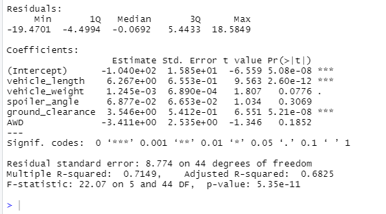

# MechaCar_Statistical_Analysis
## Linear Regression to Predict MPG
- Which variables/coefficients provided a non-random amount of variance to the mpg values in the dataset?
The variables that provided non-random amount of variance are vehicle weight, spoiler_angle and AWD.
Ground_clearance and vehicle_lenght provided the most amount of random variance.

- Is the slope of the linear model considered to be zero? Why or why not?
There are indications that the slope of the linear model is not zero because the p-value is less than .05

- Does this linear model predict mpg of MechaCar prototypes effectively? Why or why not?
Yes, this model predicts MechaCar prototypes effectively.
The R-squared value is .7149 which means that ~71% of the time the model will predict the mpg correctly.

## Summary Statistics on Suspension Coils
- The design specifications for the MechaCar suspension coils dictate that the variance of the suspension coils must not exceed 100 pounds per square inch. 
- Does the current manufacturing data meet this design specification for all manufacturing lots in total and each lot individually? Why or why not?

No, the current manufacturing data does not meet the design specifications.
Lot 1 and Lot 2 are both under the PSI variance requirements.
Lot 1 PSI variance is .98 and Lot 2 PSI variance is 7.47.
Lot 3 has a PSI variance of 170.29 which is over the acceptable 100 PSI variance.

