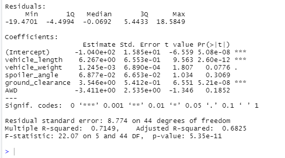
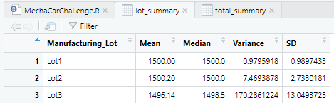
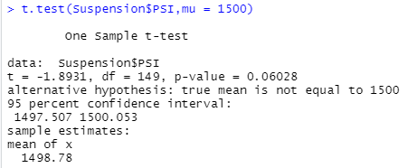
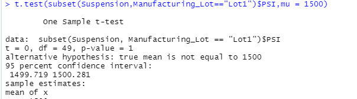
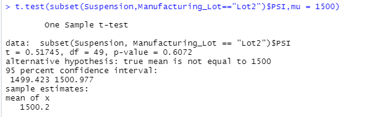
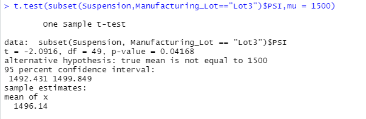

# MechaCar_Statistical_Analysis
## Linear Regression to Predict MPG
- Which variables/coefficients provided a non-random amount of variance to the mpg values in the dataset?
The variables that provided non-random amount of variance are vehicle weight, spoiler_angle and AWD.
Ground_clearance and vehicle_lenght provided the most amount of random variance.

- Is the slope of the linear model considered to be zero? Why or why not?
There are indications that the slope of the linear model is not zero because the p-value is less than .05

- Does this linear model predict mpg of MechaCar prototypes effectively? Why or why not?
Yes, this model predicts MechaCar prototypes effectively.
The R-squared value is .7149 which means that ~71% of the time the model will predict the mpg correctly.

## Summary Statistics on Suspension Coils
- The design specifications for the MechaCar suspension coils dictate that the variance of the suspension coils must not exceed 100 pounds per square inch. 
- Does the current manufacturing data meet this design specification for all manufacturing lots in total and each lot individually? Why or why not?

No, the current manufacturing data does not meet the design specifications.
Lot 1 and Lot 2 are both under the PSI variance requirements.
Lot 1 PSI variance is .98 and Lot 2 PSI variance is 7.47.
Lot 3 has a PSI variance of 170.29 which is over the acceptable 100 PSI variance.

## T-Tests on Suspension Coils
- Interpretation and Findings of t-test
Below is the summary of the t-test results across all manufacturing lots.

Based on the p-value of .06 all of the manufacturing lots are similar to the population mean of 1500.
Both Lot 1 and Lot 2 are similar to the summary statistics.
Lot 3 has a lower p-value of .04 and lower mean of 1496.14.
### Lot 1

### Lot 2

### Lot 3

## Study Design: MechaCar vs Competition
To create a statistical study to compare MechaCar against the competition would require the following.

- What metric or metrics are you going to test and what data is needed to run the statistical test??
Current price as the dependent variable with safety features, MGP, engine type and resale value as the independent variables.

- What is the null hypothesis or alternative hypothesis?
Null hypothesis - MechaCar is priced optimally based on the key metrics.

- What statistical test would you use to test the hypothesis? And why?
Linear regression would show the correlation between the current price and the independent variables.
